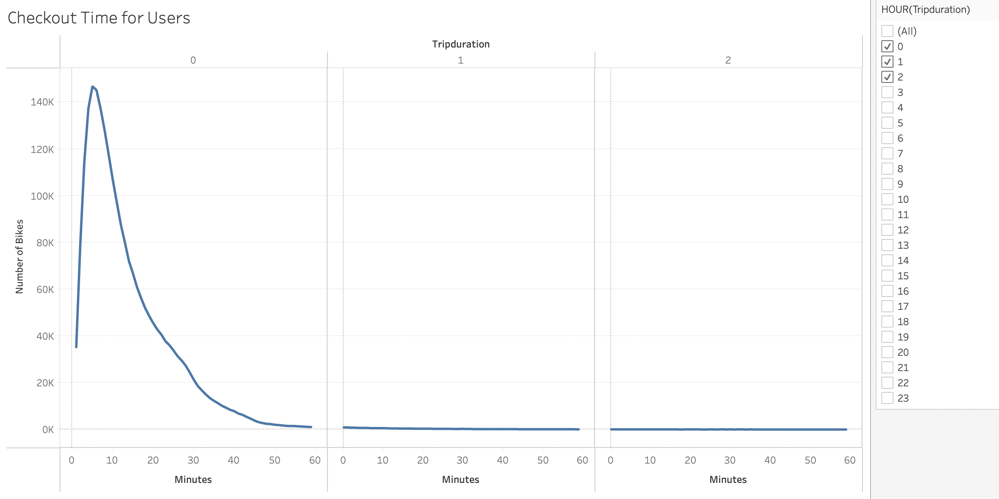
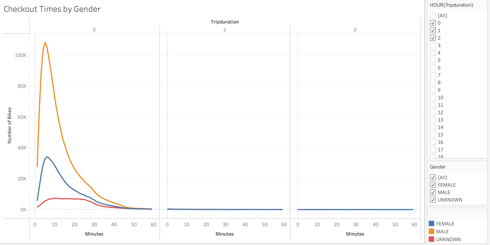
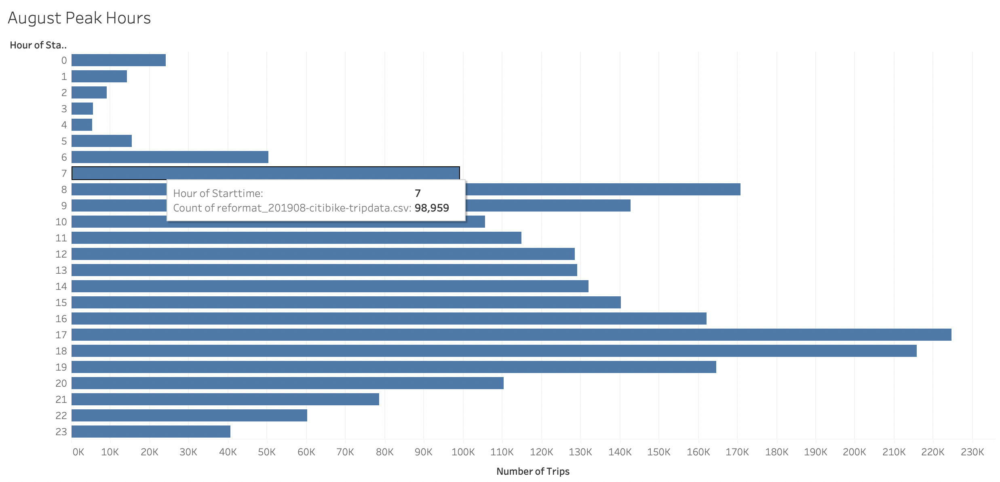
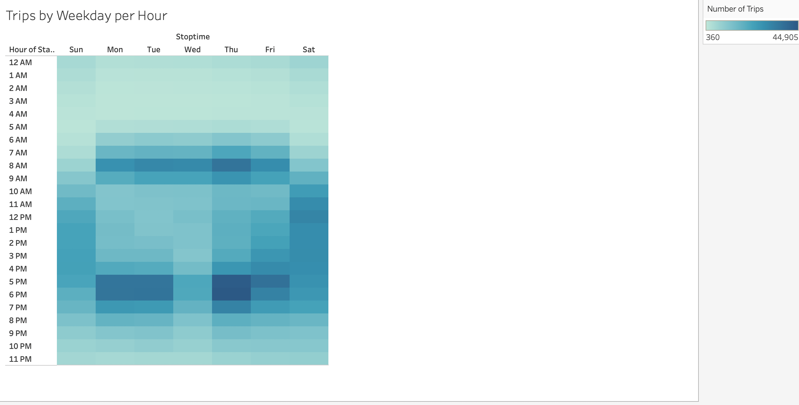
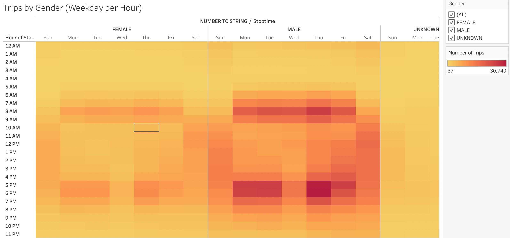
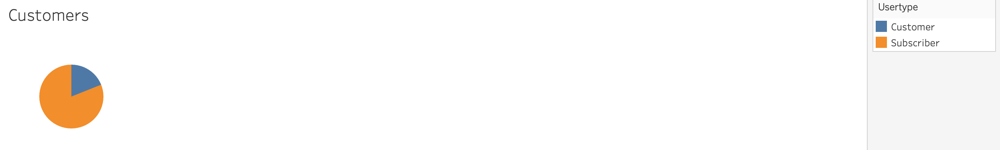
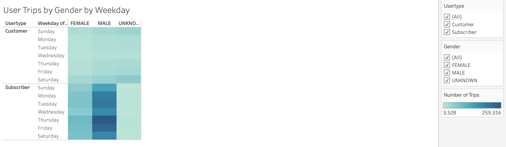

# bikesharing

The full Tableau Story can be seen [here](https://public.tableau.com/shared/9WQ4GH74J?:display_count=n&:origin=viz_share_link)

## Overview

### Purpose of Analysis
My partner and I would like to start a bike share project in Des Moines, Iowa inspired by a trip to New York and the bike share program there. In order to convince investors that a bike-sharing program is a solid business proposal, we will provide the potential stakeholders with an understandable and easy to read analysis via Tableau Story of the New York bike sharing trends. After reformatting the data using Python, the analysis includes:

- the length of time that bikes are checked out for all riders and genders
- the number of bike trips for all riders and genders for each hour of each day of the week
- the number of bike trips for each type of user and gender for each day of the week.

## Results

### New York Citi Bike Share Visualizations

Most rides are less than 30 minutes with a concentration of rides between 4-8 minutes. The longer the duration of the ride, the less number of rides there are.

The trend of the duration of times per gender mimic the overall trend, however, males take more rides than females. 

The peak hours of August 2019 were between the hours of 5:00PM to 7:00PM.

There is a large concentration of rides between 6:00AM-9:00AM and 5:00PM-7:00PM during Monday-Friday.
On the weekends there is a more even spread of use between 10:00AM to 8:00PM.

In both the male and female populations overall trend of trips per weekday per hour, as seen above, persists. This breakout is consistent with males taking more rides.

Most riders are annual subscribers, rather than sporadic or short term customers.

Short term customers take less rides than annual subscribers. Short term customers have an even spread of use regardless of gender or weekday. Annual subscribers have mostly male riders and the males have the highest concentration of rides on Tuesdays, Thursdays, and Fridays.

## Summary

The analysis reveals that there is a large concentration of rides between 6:00AM-9:00AM and 5:00PM-7:00PM during Monday-Friday. It can be assumed that a large portion of these rides are due to workers using the bike share program as an option for commuting to work. Also, it is clear that a majority of the users are male and annual subscribers to the program. 

For future analysis I would suggest two more visualizations:
- the average age of user per gender per peak hours 
- the average age of users in the various peak areas of the city 

Both visualizations could help in marketing and targeting an audience in Des Moines.

